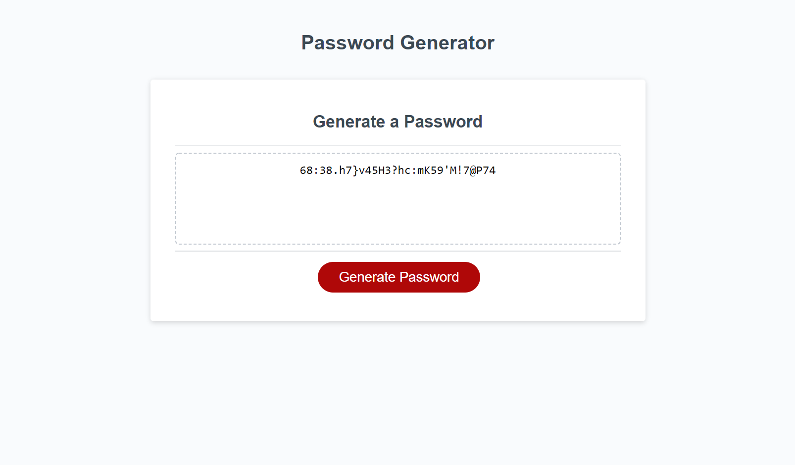

# Module 3 Challenge - Password Generator

This repository is a password generator, my first app written in JavaScript.

---

When the user clicks the "Generate Password" button it will
- prompt the user to enter a character amount for their password between 8 and 128 characters
- ask them if they want to use upper case letters, lower case letters, numbers, and/or special characters in their password
- generate a password based on the selected criteria and display it in the text area

---

[Deployment Link](https://agoetz4407.github.io/password-generator)

---

